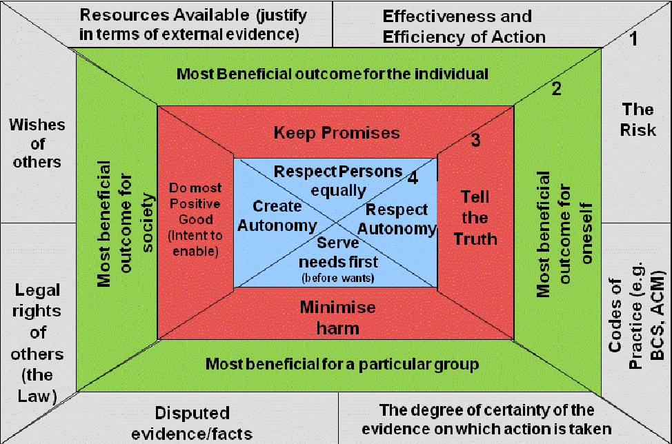

-   [What is Ethics?](#what-is-ethics)
-   [What is Public Health Ethics?](#what-is-public-health-ethics)
-   [Principles of Ethical Practice in Public Health](#principles-of-ethical-practice-in-public-health)
-   [Types of Ethics for a Public Health Professional](#types-of-ethics-for-a-public-health-professional)
-   [Steps in a Process of Ethical Decision Making](#steps-in-a-process-of-ethical-decision-making)
-   [Importance of Ethics for Public Health Professionals](#importance-of-ethics-for-public-health-professionals)
-   [References and For More Information](#references-and-for-more-information)

## What is Ethics?

-   Ethics are the set of rules that govern our expectations of our own and others' behavior.
-   The term 'ethics' is derived from the Greek word *ethos* that can mean custom, tradition, personality or disposition.
-   Ethics is a system of moral principles. They affect how people make choices and lead their existence.
-   Ethics is concerned with what is virtuous for persons and society and is defined as moral philosophy.
-   Ethics is the guideline for responsibly conducting the task.

**Ethics covers the following dimensions:**

-   Our moralities and accountabilities.
-   The language of right and wrong.
-   Ethical decisions — what is good and bad?
-   How to live a good life?

## What is Public Health Ethics?

-   Public health ethics pursues to comprehend and simplify principles and values which guide public health actions.
-   Principles and values offer an agenda for decision making and a means of justifying decisions.
-   Public health actions are often commenced by governments and are focused at the population level; the principles and values that guide public health can therefore vary from those that guide actions in natural science and clinical medicine, which are more patient- or individual-centered.
-   However, public health ethics includes all the actions and activities carried out directly or indirectly by public health related organizations as well.
-   On the basis of nature of work, public health ethics can be broadly divided into: (i) ethical principles of research and (ii) ethical principles during other public health programs.

## Principles of Ethical Practice in Public Health

**1. Causes of disease to prevent adverse health outcomes:**

-   Public health should address principally the fundamental causes of ill health and requirements for health, aiming to prevent adverse health outcomes.
-   It should not only give priority to prevention of ill health but also focus on the most fundamental levels.
-   The principle acknowledges that public health will concern itself with some immediate causes and some curative roles.

**2. Rights of individuals:**

-   Public health should achieve community health in a way that respects the rights of individuals in the community.

**3. Community inputs to policy and programs:**

-   Public health policies, programs and priorities should be developed and evaluated through processes that ensure opportunity for input from community members.

**4. Seek information to implement policies and programs:**

-   Public health should seek the information needed to implement effective policies and programs that protect and promote health.

**5. Empowerment of marginalized communities, resources and accessibility of health:**

-   Public health should advocate and work for the empowerment of marginalized and socially excluded community members, aiming to ensure that the basic resources and conditions necessary for health are accessible to all.

**6. Public health institutions and community consent to policy/program decisions:**

-   Public health institutions should provide communities with the information they have that is needed for decisions on policies and programs.
-   Public health programs should also obtain the community's consent for their implementation.

**7. Public mandate:**

-   Public health institutions should act in a timely manner on the information they have within the resources and the mandate given to them.

**8. Program implementation and physical, social environment:**

-   Public health programs and policies should be implemented in a manner that enhances the physical and social environment.

**9. Public health policy/programs approaches and values, beliefs and culture:**

-   Public health programs and policies should incorporate a variety of approaches that anticipate and respect diverse values, beliefs, and cultures in the community.

**10. Protection of information confidentiality:**

-   Public health institutions and professionals should protect the confidentiality of information that can bring harm to an individual or community if made public.
-   Exceptions must be justified on the basis of the high likelihood of significant harm to the individual or others.

**11. Public health institutions and competency of employees:**

-   Public health institutions should ensure the professional competency of their employees.

**12. Public health institutions and employees for public trust:**

-   Public health institutions and their employees should engage in collaborations, networking and affiliations in ways that build the public trust and the institutions' effectiveness.

{width=100%}

*Source: [Seedhouse's Ethical Grid (Seedhouse, 1998b)](https://www.researchgate.net/figure/Seedhouses-Ethical-Grid-Seedhouse-1998b_fig1_42800390)*

## Types of Ethics for a Public Health Professional

**a) Professional ethics:**

-   Also known as *ethics of public health*.
-   Professional ethics relates to the mission of public health to protect and promote health and emphasises the merits of professional personality of public health practitioners who hold themselves liable to morals or codes of ethics.

**b) Applied ethics:**

-   Also known as *ethics in public health*.
-   Applied ethics seeks to improve common principles that can be applied to practical circumstances to direct ethical practice.
-   It is situation-specific in that it "seeks out to detect morally applicable decisions in tangible cases."

**c) Advocacy ethics:**

-   Also known as *ethics for public health*.
-   Advocacy ethics is a less theoretic approach and probably epitomizes the most persistent ethical orientation in practice.
-   Public health practitioners see themselves as promoters.
-   Advocacy ethics includes taking a standpoint for the goals, intermediations, and improvements that are most likely to accomplish the moral aims of public health.

**d) Critical public health ethics:**

-   Critical public health ethics sheds light on matters that may be hidden from outlook by customary ways of thinking or acting.
-   Critical ethics is generally informed, practically oriented, and deliberates social values and tendencies in examining and understanding both the public health state at hand and the ethical problems it raises.

## Steps in a Process of Ethical Decision Making

-   Recognition/identification of the issue
-   Data collection/gathering
-   Framing the issues
-   Evaluation of morally relevant conditions and considerations
-   Implementation of decision
-   Evaluation of decision-making process

## Importance of Ethics for Public Health Professionals

-   To ensure dignity, rights and welfare of the people/citizens.
-   To foster major development in health research, scientific advances, newer vaccines, and drugs.
-   To balance respect for individual freedom and liberty.
-   To make the government responsible to provide their citizens with some degree of protection in relation to health.
-   To build trust between the public health professionals and the people.
-   To promote social and moral values.
-   Ethics help to internationalize public health issues.
-   To ensure individual sovereignty and liberty of the people.
-   To understand the fundamental issues raised in public health over the role of governments; to identify the shortcomings of existing models in bioethics and deal with such issues; and to ensure global relevance of health and public health that makes these issues so pertinent.
-   Ethical standards uphold the values that are vital to cooperative work, such as belief, answerability, mutual respect, and impartiality.
-   Public-health ethics are also an important deliberation at an international level to ensure international support and collaboration.

## References and For More Information

-   <https://www.cdc.gov/od/science/integrity/phethics/index.htm>
-   <https://www.who.int/bulletin/volumes/86/8/08-052431/en/>
-   <https://www.researchgate.net/publication/23263955_The_importance_of_public-health_ethics>
-   <https://www.ncbi.nlm.nih.gov/pmc/articles/PMC1447186/>
-   <https://www.ncbi.nlm.nih.gov/pmc/articles/PMC2431097/>
-   <http://www.bbc.co.uk/ethics/introduction/intro_1.shtml>
-   <https://www.researchgate.net/publication/281969790_Introduction_to_Public_Health_Ethics_Background>
-   <https://www.thehastingscenter.org/briefingbook/public-health/>
-   <https://www.intechopen.com/books/current-topics-in-public-health/the-role-of-ethics-in-public-health-clinical-research>
